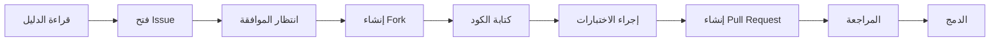

# 🤝 دليل المساهمة في لغة وسام

<div align="center">

**شكراً لاهتمامك بالمساهمة في تطوير لغة وسام!**

⚠️ **يرجى قراءة هذا الدليل بعناية قبل المساهمة**

</div>

---

## 📋 جدول المحتويات

1. [قواعد عامة](#قواعد-عامة)
2. [شروط المساهمة](#شروط-المساهمة)
3. [عملية المساهمة](#عملية-المساهمة)
4. [معايير الكود](#معايير-الكود)
5. [الاختبارات](#الاختبارات)
6. [المراجعة](#المراجعة)
7. [الأسئلة الشائعة](#الأسئلة-الشائعة)

---

## ⚠️ قواعد عامة

### الممنوعات ❌

| الممنوع | السبب |
|---------|-------|
| إزالة إشعارات حقوق النشر | حماية الملكية الفكرية |
| تغيير الترخيص الأساسي | الحفاظ على حرية الاستخدام |
| إضافة dependencies خارجية دون موافقة | الحفاظ على استقلالية اللغة |
| تغيير الاسم أو الشعار | حماية العلامة التجارية |
| إضافة ميزات تتعارض مع رؤية اللغة | الحفاظ على الاتساق |
| كود غير آمن أو ضار | حماية المستخدمين |

### المسموحات ✅

| المسموح | الشرط |
|---------|-------|
| إصلاح الأخطاء | مع اختبارات مناسبة |
| إضافة مكتبات جديدة | بموافقة مسبقة |
| تحسين الأداء | مع benchmarks |
| تحديث التوثيق | باللغة العربية |
| ترجمة التوثيق | مع الحفاظ على الدقة |
| إضافة أمثلة | مع شرح واضح |

---

## 📝 شروط المساهمة

### 1. الموافقة المسبقة

**يجب الحصول على موافقة قبل أي مساهمة كبيرة:**

```
الخطوات:
1. اقرأ هذا الدليل بالكامل
2. افتح issue لوصف المساهمة المقترحة
3. انتظر الموافقة من المشرفين
4. بعد الموافقة، ابدأ العمل
```

**للتواصل:**
- 📧 البريد: droy.ree@gmail.com
- 🐛 Issues: [GitHub Issues](../../issues)

### 2. أنواع المساهمات المقبولة

#### 🐛 إصلاح الأخطاء (Bug Fixes)
- **الأولوية:** عالية
- **الموافقة:** فورية (للأخطاء الحرجة)
- **الشروط:**
  - وصف واضح للخطأ
  - خطوات إعادة الإنتاج
  - اختبار يثبت الإصلاح

#### ✨ ميزات جديدة (Features)
- **الأولوية:** متوسطة
- **الموافقة:** مطلوبة
- **الشروط:**
  - وصف تفصيلي للميزة
  - توضيح الفائدة
  - عدم التعارض مع الميزات الحالية

#### 📖 التوثيق (Documentation)
- **الأولوية:** عالية
- **الموافقة:** سريعة
- **الشروط:**
  - باللغة العربية أساساً
  - أمثلة واضحة
  - تحديث README إذا لزم

#### 🧪 الاختبارات (Tests)
- **الأولوية:** عالية
- **الموافقة:** فورية
- **الشروط:**
  - تغطية شاملة
  - وصف واضح لكل اختبار
  - اجتياز جميع الاختبارات الحالية

### 3. شروط الكود

#### جودة الكود
```c
// ✅ مثال جيد
/**
 * دالة لحساب المجموع
 * @param args مصفوفة الأرقام
 * @param arg_count عدد العناصر
 * @return مجموع الأرقام
 */
Value lib_math_sum(Value *args, int arg_count) {
    if (arg_count < 1 || args[0].type != VAL_ARRAY) {
        return value_create_exception("يتطلب مصفوفة أرقام", 1);
    }
    
    double sum = 0;
    for (int i = 0; i < args[0].as.array.count; i++) {
        if (args[0].as.array.items[i]->type == VAL_NUMBER) {
            sum += args[0].as.array.items[i]->as.number;
        }
    }
    
    return value_create_number(sum);
}

// ❌ مثال سيء
Value sum(Value *a, int n) {
    double s = 0;
    for(int i=0;i<n;i++) s+=a[i].as.number;
    return value_create_number(s);
}
```

#### متطلبات الكود
- [ ] تعليقات بالعربية للدوال
- [ ] أسماء واضحة ومعبرة
- [ ] التحقق من المدخلات
- [ ] معالجة الأخطاء
- [ ] عدم تسريب الذاكرة

---

## 🔄 عملية المساهمة

### خطوات المساهمة



### 1. إعداد البيئة

```bash
# استنساخ المستودع
git clone https://github.com/droy-go/wisam-lang.git
cd wisam-lang

# إنشاء فرع جديد
git checkout -b feature/اسم-الميزة

# أو لإصلاح خطأ
git checkout -b fix/وصف-الخطأ
```

### 2. كتابة الكود

```bash
# بناء المشروع
make clean && make

# تشغيل الاختبارات
make test

# التحقق من الأخطاء
make check
```

### 3. إرسال المساهمة

```bash
# commit واضح
git commit -m "✨ إضافة: وصف الميزة

- التفاصيل 1
- التفاصيل 2

Closes #123"

# push
git push origin feature/اسم-الميزة
```

### 4. Pull Request

**قالب Pull Request:**

```markdown
## 📋 وصف
وصف موجز للتغييرات

## 🎯 نوع التغيير
- [ ] 🐛 إصلاح خطأ
- [ ] ✨ ميزة جديدة
- [ ] 📖 تحديث توثيق
- [ ] 🧪 اختبارات
- [ ] ⚡ تحسين أداء

## ✅ قائمة المراجعة
- [ ] الكود يتبع معايير اللغة
- [ ] تم إضافة الاختبارات
- [ ] جميع الاختبارات تمر
- [ ] التوثيق محدث
- [ ] لا يوجد تسريب للذاكرة

## 🧪 اختبارات
وصف الاختبارات المضافة

## 📸 لقطات شاشة (إن وجدت)
```

---

## 📐 معايير الكود

### تسمية المتغيرات

| النوع | الصيغة | مثال |
|-------|--------|------|
| دوال | snake_case | `lib_math_sum` |
| متغيرات | snake_case | `token_count` |
| ثوابت | UPPER_CASE | `MAX_TOKEN_LENGTH` |
| أنواع | PascalCase | `TokenType` |
| هياكل | PascalCase | `ASTNode` |

### تنسيق الكود

```c
// المسافات البادئة: 4 مسافات
if (condition) {
    statement;
}

// الأقواس: K&R style
void function() {
    // code
}

// التعليقات
// تعليق سطر واحد

/**
 * تعليق متعدد الأسطر
 * مع وصف مفصل
 */
```

### الأمان

```c
// ✅ التحقق من المؤشرات
if (!ptr) return NULL;

// ✅ التحقق من الحدود
if (index >= 0 && index < array.count) {
    // access
}

// ✅ إدارة الذاكرة
char *str = malloc(size);
if (!str) return NULL;
// ... use str ...
free(str);
```

---

## 🧪 الاختبارات

### هيكل الاختبار

```c
// tests/test_example.c
#include "test_framework.h"

TEST(test_description) {
    // Arrange
    Value arr = value_create_array();
    
    // Act
    value_array_push(&arr, value_create_number(5));
    
    // Assert
    ASSERT_EQ(arr.as.array.count, 1);
    ASSERT_EQ(arr.as.array.items[0]->as.number, 5);
    
    value_free(&arr);
}

TEST_SUITE(math_tests) {
    RUN_TEST(test_description);
}
```

### تشغيل الاختبارات

```bash
# جميع الاختبارات
make test

# اختبار محدد
./bin/test_math

# مع تفاصيل
make test VERBOSE=1
```

---

## 👀 المراجعة

### معايير المراجعة

1. **الجودة:** الكود يتبع المعايير
2. **الوظيفة:** الميزة تعمل كما هو متوقع
3. **الأمان:** لا يوجد ثغرات أمنية
4. **الأداء:** لا يوجد انحدار في الأداء
5. **التوثيق:** التوثيق محدث

### حالات الرفض

- ❌ كود لا يتبع المعايير
- ❌ لا يوجد اختبارات
- ❌ فشل الاختبارات الحالية
- ❌ تسريب ذاكرة
- ❌ عدم توافق مع الإصدارات السابقة

---

## ❓ الأسئلة الشائعة

### س: هل يمكنني المساهمة بدون خبرة في C؟
**ج:** نعم! يمكنك المساهمة في:
- التوثيق
- الأمثلة
- الترجمات
- اختبار اللغة

### س: كم وقت تستغرق الموافقة؟
**ج:**
- إصلاحات الأخطاء: 1-3 أيام
- التوثيق: 2-5 أيام
- الميزات الجديدة: 1-2 أسابيع

### س: هل يمكنني إضافة مكتبة جديدة؟
**ج:** نعم، مع:
- وصف تفصيلي للمكتبة
- توضيح الفائدة
- اختبارات شاملة
- توثيق كامل

### س: ماذا لو تم رفض مساهمتي؟
**ج:** لا بأس! ستحصل على تعليقات لتحسينها. يمكنك:
- تعديل الكود حسب التعليقات
- مناقشة البدائل
- طلب توضيحات إضافية

### س: هل يمكنني استخدام الكود في مشروعي؟
**ج:** نعم، وفقاً لشروط الرخصة. راجع ملف LICENSE.

---

## 🙏 شكراً!

نشكر جميع المساهمين على جهودهم في تطوير لغة وسام.

### قائمة المساهمين

| الاسم | المساهمة | GitHub |
|-------|----------|--------|
| droy-go | المؤسس والمطور الرئيسي | [@droy-go](https://github.com/droy-go) |
| [اسمك هنا] | [مساهمتك] | [@username] |

---

<div align="center">

**صنع بـ ❤️ في الوطن العربي**

[العودة للأعلى ⬆️](#-جدول-المحتويات)

</div>
